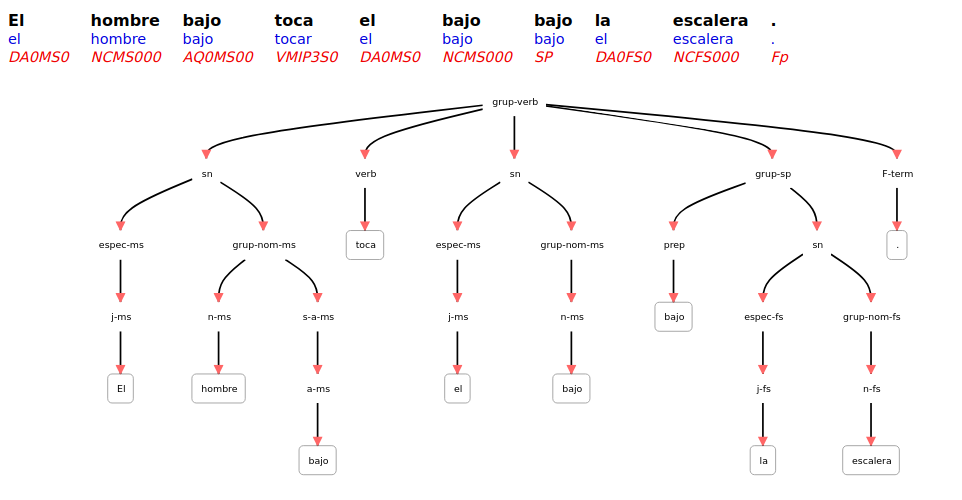
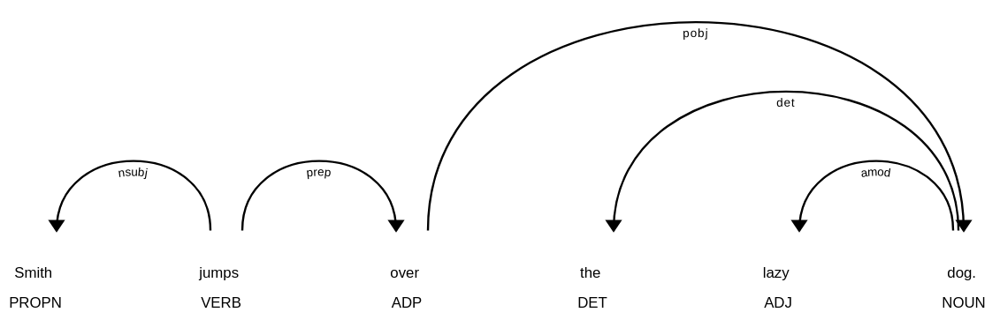

class: center, middle

### Introduction to Human Language Technologies

# Lab.1: Framework

Gerard Escudero & Jordi Turmo

Natural Language Research Group

<br>

## Master on Artificial Intelligence

<br>


---
class: left, middle, inverse

# Outline

* .cyan[Presentation]

* Linguistic resources

* Exercise

* Additional information

---

# Goal of IHLT lab sessions

* Learn to use basic NLP functions for managing text content

* Solve simple programming exercises

.cols5050[
.col1[
#### Software Platform

  - [Google Colab](https://colab.research.google.com) <br> code & documentation

  - [Google Drive](https://drive.google.com) <br> data & models
]
.col2[
#### Components:

  - Jupyter 

  - Python3

  - nltk, spaCy & Freeling
]]

---

# Evaluation of IHLT lab

#### Mandatory exercises & projects:

* a set of exercises solved in lab sessions (in pairs)

* the project Semantic Textual Similarity (in pairs)

.blue[Grade = 0.4 Project + 0.1  Sessions] <br>
(this represents the 50% of the final IHLT grade)

Jupyter notebooks of exercises & projects should be
uploaded to [https://raco.fib.upc.edu](https://raco.fib.upc.edu)

**Evaluation criteria**:

- Correctness
- Clarity and organization
- Analysis and conclusions

---

# Topic of the project (STS)

#### How similar two sentences are between them? compare different approaches

* Relevance of the topic: <br><br>
IR, QA, summarization, automatic translation, plagiarism
detection, ...

* *Paraphrase* : pair of texts with the same meaning but different words

* Example from trial of project data set: <br><br>
`The bird is bathing in the sink.` <br><br>
`Birdie is washing itself in the water basin.`

---

# Project description

#### Deadline: oral presentation session

* Implement some approaches to detect paraphrase using
sentence similarity metrics. 
  - Explore some lexical dimensions.
  - Explore the syntactic dimension alone.
  - Explore the combination of both previous.

* Not word neither sentence embeddings should be allowed.

* Compare and comment the results achieved by these approaches
among them and among the official results.

* Use data set and description of task Semantic Textual Similarity in SemEval 2012: <br>
[https://www.cs.york.ac.uk/semeval-2012/task6/index.html](https://www.cs.york.ac.uk/semeval-2012/task6/index.html)

* Deliver to raco:
  - Jupyter notebook: sts-[Student1]-[Student2].ipynb
  - Slides: sts-[Student1]-[Student2].pdf

---
class: left, middle, inverse

# Outline

* .brown[Presentation]

* .cyan[Linguistic resources]

* Exercise

* Additional information

---

# Natural Language Toolkit

.small[- Open-source Python library: [https://www.nltk.org/](https://www.nltk.org/)]

.cols5050[
.col1[
**Example:**

.small[
```python3
!pip install svgling
import nltk
import svgling
nltk.download('punkt')
nltk.download('averaged_perceptron_tagger')
nltk.download('maxent_ne_chunker')
nltk.download('words')
s = 'Mark is working at Google.'
x = nltk.pos_tag(nltk.word_tokenize(s))
t = nltk.ne_chunk(x)
svgling.draw_tree(t)
```
]
.center[]
]
.col2[
**Content:**

* *Corpus*: Brown corpus (PoS), sentence polarity corpus... 

* *Lexical resources*: WordNet, SentiWordNet...

* *Grammars*: English, Spanish, ...

* *Models*: Named Entities, taggers...
]]

---

# FreeLing

.small[
- C++ library: [https://nlp.lsi.upc.edu/freeling/](https://nlp.lsi.upc.edu/freeling/)

- It has and http API, [TextServer](https://textserver.lsi.upc.edu/textserver/login).
]

[Demo](https://nlp.lsi.upc.edu/freeling/demo/demo.php):



---

# spaCy

- Python library with a neural model: [https://spacy.io/](https://spacy.io/)

**Example:**

```
[('Smith', 'NNP', 'nsubj', jumps),
 ('jumps', 'VBZ', 'ROOT', jumps),
 ('over', 'IN', 'prep', jumps),
 ('the', 'DT', 'det', dog),
 ('lazy', 'JJ', 'amod', dog),
 ('dog', 'NN', 'pobj', over),
 ('.', '.', 'punct', jumps)]
```



---
class: left, middle, inverse

# Outline

* .brown[Presentation]

* .brown[Linguistic resources]

* .cyan[Exercise]

* Additional information

---

# Corpus reader

[http://www.nltk.org/howto/corpus.html](http://www.nltk.org/howto/corpus.html)

corpus reader objects & classes: <br>
`from nltk.corpus import *resource* [as *variable name*]`

Gutenberg corpora:

```python3
nltk.download('gutenberg')
nltk.corpus.gutenberg.fileids()
txt = nltk.corpus.gutenberg.words('austen-persuasion.txt')
```

Example of *Corpus reader* using the *Gutenberg corpora*: 

* [view](codes/s1a.html) / [download](codes/s1a.ipynb)

---

# Stopwords reader

Provide the list of stop words of a specific language. 

Words that do not have individual meaning 
* pronouns
* determiners
* auxiliary verbs
* ...

Example of *Stopwords reader*:

* [view](codes/s1b.html) / [download](codes/s1b.ipynb)

---

# Exercise

#### Requirements: 

```
import nltk

nltk.download('gutenberg')

nltk.download('stopwords')
```

#### Statement:

1. Develop a colab notebook that show the 25
non-stopwords with more number of occurrences in the file
'blake-poems.txt' of Gutenberg corpus.

Upload the *ipynb* file of the exercise to the Raco.

---
class: left, middle, inverse

# Outline

* .brown[Presentation]

* .brown[Linguistic resources]

* .brown[Exercise]

* .cyan[Additional information]

---

# Class Text

It allows:

* Consulting occurrences of words

* Consulting contexts

* Drawing dispersion plots

Example of *Class Text*:

* [view](codes/s1c.html) / [download](codes/s1c.ipynb)


.col5050[
.col1[
## Plain Text

Loading corpus from a text file:

* [view](codes/s1d.html) / [download](codes/s1d.ipynb)

* Attached resource:
[`pg35688.txt`](resources/pg35688.txt)
]
.col2[
## Web Example

Fetching web data as string: 

* [view](codes/s1e.html) / [download](codes/s1e.ipynb)
]
]

