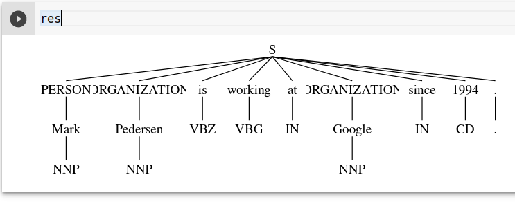

class: center, middle

### Introduction to Human Language Technologies

# Lab.7: Word Sequences

Gerard Escudero & Jordi Turmo

Natural Language Research Group

<br>

## Master on Artificial Intelligence

<br>


---
class: left, middle, inverse

# Outline

* .cyan[Session requirements]

* NERC models

* Paraphrases

* Learning sequences

---

# Session requirements

Maximum Entropy Name Entity Chunker:

* Both Linux and Windows (via python)

```python3
import nltk

nltk.download('maxent ne chunker')
nltk.download('conll2000')
```

Stanford CoreNLP:
* Linux (via shell)
  - Install [CoreNLP](https://stanfordnlp.github.io/CoreNLP/download.html),

  - and execute CoreNLP server: <br>
`java -mx4g -cp
"whole path/stanford-corenlp-full-2017-06-09/*" edu.stanford.nlp.pipeline.StanfordCoreNLPServer -port 9000 -timeout 15000`

  - make sure you have intalled the later java version

---
class: left, middle, inverse

# Outline

* .brown[Session requirements]

* .cyan[NERC models]

* Paraphrases

* Learning sequences

---

# NERC models in NLTK

Default model:

Maximum entropy model (PERSON, LOCATION, ORGZATION) trained with ACE corpus

```python3
from nltk import ne_chunk
ne_chunk(POS tagged sent, binary=False)
```

  - `binary: True` is used just to recognize NEs, without
classifying them into the three NE classes.

  - `Output: tree` format by default. <br>
Use `nltk.chunk.tree2conllstr(ner_output)` to get CoNLL format.


NLTK doesn’t have an English corpus for NERC (CoNLL2002 corpus for Spanish and Dutch).

Example:

* [view](codes/nerc.html) / [download](codes/nerc.ipynb)

---

# NERC models in CoreNLP

Third party model: Stanford CoreNLP server

* CRFs and rule models (PER, LOC, ORG, DATE, TIME, MONEY, ...)

```python3
from nltk.tag.stanford import CoreNLPNERTagger

CoreNLPNERTagger(url=’http://localhost:9000’).tag(tokenized sent)
```

make sure you have installed at least nltk version 3.2.5

* Previously, install [CoreNLP](https://stanfordnlp.github.io/CoreNLP/download.html),

* and execute CoreNLP server:<br>
`java -mx4g -cp "whole path/stanford-corenlp-full-2017-06-09/*" edu.stanford.nlp.pipeline.StanfordCoreNLPServer -port 9000 -timeout 15000`

make sure you have intalled the later java version

Example:

* [view](codes/nerc.html) / [download](codes/nerc.ipynb)

---
class: left, middle, inverse

# Outline

* .brown[Session requirements]

* .brown[NERC models]

* .cyan[Paraphrases]

* Learning sequences

---

# Mandatory exercise

Statement:

1. Read all pairs of sentences of the trial set within the evaluation framework of the project.

2. Compute their similarities by considering the following approach:

  * words plus NEs and Jaccard coefficient <br>
ex: `word_and_NEs=['John Smith', 'is', 'working']`

3. Show the results. 

4. Do you think it could be relevant to use NEs to compute the similarity between two sentences?
Justify the answer.

---
class: left, middle, inverse

# Outline

* .brown[Session requirements]

* .brown[NERC models]

* .brown[Paraphrases]

* .cyan[Learning sequences]

---

# NLTK RegexpParser

Example:

* [view](codes/RegExp.html) / [download](codes/RegExp.ipynb)

### Optional exercise

Enlarge the previous grammar to parse the next sentence as follows:

```
[("the", "DT"), ("little", "JJ"), ("yellow", "JJ"),("dog", "NN"),\
 ("barked", "VBD"), ("at", "IN"), ("the", "DT"), ("cat", "NN"), \
 ("in", "IN"), ("New", "NNP"), ("York", "NNP")]
```



---

# Conll 2000 Corpus

Problem: 

These two sentences have same PoS labels an different chunks.

* `Joey/NN sold/VBD the/DT farmer/NN rice/NN ./.`

* `Nick/NN broke/VBD my/DT computer/NN monitor/NN ./.`

Example:

* Sentences in Conll2000

* Chunking evaluation

* IOB format

* [view](codes/conll2000.html) / [download](codes/conll2000.ipynb)
