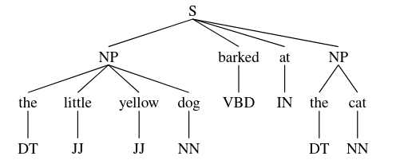
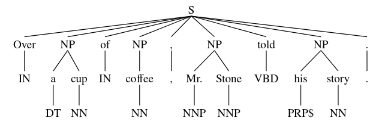
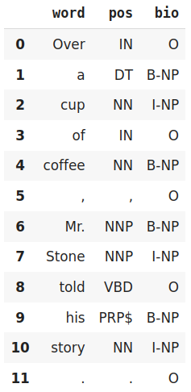

class: center, middle

### Introduction to Human Language Technologies

# Lab.7: Word Sequences

Gerard Escudero & Jordi Turmo

Natural Language Research Group

<br>

## Master on Artificial Intelligence

<br>


---
class: left, middle, inverse

# Outline

* .cyan[NERC models]

* Exercise

* Learning sequences

---

# NERC in NLTK I

Maximum Entropy Model (PERSON, LOCATION, ORGANIZATION)

**Requirements**:

```python3
import nltk
nltk.download('punkt')
nltk.download('averaged_perceptron_tagger')
nltk.download('maxent_ne_chunker')
nltk.download('words')
```

**Use**:

```python3
sentence = "Mark Pedersen is working at Google since 1994."

res = nltk.ne_chunk(
        nltk.pos_tag(
          nltk.word_tokenize(sentence)))

type(res)  👉  nltk.tree.tree.Tree
```

---

# NERC in NLTK II

**Result**:

.cols5050[
.col1[
```python3
print(res)
👉  (S
      (PERSON Mark/NNP)
      (ORGANIZATION Pedersen/NNP)
      is/VBZ
      working/VBG
      at/IN
      (ORGANIZATION Google/NNP)
      since/IN
      1994/CD
      ./.)
```
]
.col2[
```python3
!pip install svgling
import svgling
```


]]

---

# NERC in spaCy I

**Requirements**:

```python3
import spacy
nlp = spacy.load('en_core_web_sm')
```

**Use**:

```python3
sentence = "Mark Pedersen works at Google since 1994."
doc = nlp(sentence)

[(token.text, token.pos_, token.tag_, token.lemma_, token.is_stop, 
  token.ent_iob_, token.ent_type_) for token in doc]
👉
[('Mark', 'PROPN', 'NNP', 'Mark', False, 'B', 'PERSON'),
 ('Pedersen', 'PROPN', 'NNP', 'Pedersen', False, 'I', 'PERSON'),
 ('works', 'VERB', 'VBZ', 'work', False, 'O', ''),
 ('at', 'ADP', 'IN', 'at', True, 'O', ''),
 ('Google', 'PROPN', 'NNP', 'Google', False, 'B', 'ORG'),
 ('since', 'SCONJ', 'IN', 'since', True, 'O', ''),
 ('1994', 'NUM', 'CD', '1994', False, 'B', 'DATE'),
 ('.', 'PUNCT', '.', '.', False, 'O', '')]
```

---

# NERC in spaCy II

**Extraction of entities**:

```python3
[(ent.text, ent.label_) for ent in doc.ents]
👉
[('Mark Pedersen', 'PERSON'), ('Google', 'ORG'), ('1994', 'DATE')]
```


---

# NERC in spaCy III

**Work with multiwords**:

```python3
with doc.retokenize() as retokenizer:
    tokens = [token for token in doc]
    for ent in doc.ents:
        retokenizer.merge(doc[ent.start:ent.end], 
            attrs={"LEMMA": " ".join([tokens[i].text 
                                for i in range(ent.start, ent.end)])})

[(token.text, token.pos_, token.tag_, token.lemma_, token.is_stop, 
  token.ent_iob_, token.ent_type_) for token in doc]
👉
[('Mark Pedersen', 'PROPN', 'NNP', 'Mark Pedersen', False, 'B', 'PERSON'),
 ('works', 'VERB', 'VBZ', 'work', False, 'O', ''),
 ('at', 'ADP', 'IN', 'at', True, 'O', ''),
 ('Google', 'PROPN', 'NNP', 'Google', False, 'B', 'ORG'),
 ('since', 'SCONJ', 'IN', 'since', True, 'O', ''),
 ('1994', 'NUM', 'CD', '1994', False, 'B', 'DATE'),
 ('.', 'PUNCT', '.', '.', False, 'O', '')]
```

---

# NERC in TextServer

### Requirements: [textserver.py](../codes/textserver.py)

```
from google.colab import drive
import sys

drive.mount('/content/drive')
sys.path.insert(0, '/content/drive/My Drive/Colab Notebooks/ihlt')
from textserver import TextServer
```

### Use:

```python3
ts = TextServer('user', 'passwd', 'entities')
ts.entities("Mark Pedersen works at Google since 1994.")
👉
[[['Mark_Pedersen', 'mark_pedersen', 'NP00SP0', 'noun', 'N/A', 'person'],
  ['works', 'work', 'VBZ', 'verb', '01525666-v', 'N/A'],
  ['at', 'at', 'IN', 'preposition', 'N/A', 'N/A'],
  ['Google', 'google', 'NP00G00', 'noun', '06578905-n', 'location'],
  ['since', 'since', 'IN', 'preposition', 'N/A', 'N/A'],
  ['1994', '1994', 'Z', 'number', 'N/A', 'N/A'],
  ['.', '.', 'Fp', 'punctuation', 'N/A', 'N/A']]]
```


---
class: left, middle, inverse

# Outline

* .brown[NERC models]

* .cyan[Exercise]

* Learning sequences

---

# Exercise

1. Read all pairs of sentences of the *SMTeuroparl* files of test set within the
evaluation framework of the project.

2. Compute their similarities by considering the following approach:

  * words plus NEs and Jaccard coefficient <br>
ex: `word_and_NEs=['John Smith', 'is', 'working']`

3. Show the results. 

4. Do you think it could be relevant to use NEs to compute the similarity between two sentences?
Justify the answer.

#### Resources:

- [`test-gold.tgz`](../sts/resources/test-gold.tgz)

---
class: left, middle, inverse

# Outline

* .brown[NERC models]

* .brown[Exercise]

* .cyan[Learning sequences]

---

# RegexpParser de l'NLTK

### Example

```python3
import nltk    
!pip install svgling
import svgling

sentence = [("the", "DT"), ("little", "JJ"), ("yellow", "JJ"),("dog", "NN"),\
            ("barked", "VBD"), ("at", "IN"), ("the", "DT"), ("cat", "NN")]

grammar = "NP: {<DT>?<JJ>*<NN>}"

cp = nltk.RegexpParser(grammar)
cp.parse(sentence)
```



---

# Conll Corpus

### Requirements

```python3
import nltk
nltk.download('conll2000')
from nltk.corpus import conll2000
```

### Use

```python3
test_sents = conll2000.chunked_sents('test.txt', chunk_types=['NP'])
sentence = conll2000.chunked_sents('train.txt', chunk_types=['NP'])[99]
sentence
👉
```


---

# IOB Format 

- .blue[In - Out - Begin]

.cols5050[
.col1[
```python3
from nltk import tree2conlltags

tree2conlltags(sentence)
👉
[('Over', 'IN', 'O'),
 ('a', 'DT', 'B-NP'),
 ('cup', 'NN', 'I-NP'),
 ('of', 'IN', 'O'),
 ('coffee', 'NN', 'B-NP'),
 (',', ',', 'O'),
 ('Mr.', 'NNP', 'B-NP'),
 ('Stone', 'NNP', 'I-NP'),
 ('told', 'VBD', 'O'),
 ('his', 'PRP$', 'B-NP'),
 ('story', 'NN', 'I-NP'),
 ('.', '.', 'O')]
```
]
.col2[

]]

---

# Evaluation

### RegexpParser Example 

```python3
import nltk
nltk.download('conll2000')
from nltk.corpus import conll2000

grammar = "NP: {<DT>?<JJ>*<NN>}"
cp = nltk.RegexpParser(grammar)

test_sents = conll2000.chunked_sents('test.txt', chunk_types=['NP'])
print(cp.accuracy(test_sents))
👉
ChunkParse score:
    IOB Accuracy:  59.7%%
    Precision:     45.3%%
    Recall:        24.2%%
    F-Measure:     31.6%%
```

---

# Conditional Random Fields I

### Example with PoS

```python3
!pip install python-crfsuite
from google.colab import drive
import nltk

nltk.download('treebank')
train = nltk.corpus.treebank.tagged_sents()[:3000]
test = nltk.corpus.treebank.tagged_sents()[3000:]

drive.mount('/content/drive')
model = nltk.tag.CRFTagger()
model.train(train,'/content/drive/My Drive/models/crfTagger.mdl')

model.accuracy(test)  👉  0.9474638463198791
```

---

# Conditional Random Fields II

### Use of a model

```python3
tagger = nltk.tag.CRFTagger()
tagger.set_model_file('/content/drive/My Drive/models/crfTagger.mdl')
tagger.tag(['the', 'men', 'attended', 'to', 'the', 'meetings'])

👉  [('the', 'DT'),
     ('men', 'NNS'),
     ('attended', 'VBD'),
     ('to', 'TO'),
     ('the', 'DT'),
     ('meetings', 'NNS')]
```

