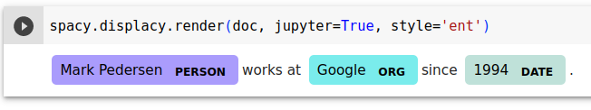

class: center, middle

### Introduction to Human Language Technologies

# Lab.7: Word Sequences

Gerard Escudero & Jordi Turmo

Natural Language Research Group

<br>

## Master on Artificial Intelligence

<br>


---
class: left, middle, inverse

# Outline

* .cyan[NERC models]

* Exercise

* Learning sequences

---

# NERC in NLTK I

Maximum Entropy Model (PERSON, LOCATION, ORGANIZATION)

**Requirements**:

```python3
import nltk
nltk.download('punkt')
nltk.download('averaged_perceptron_tagger')
nltk.download('maxent_ne_chunker')
nltk.download('words')
```

**Use**:

```python3
sentence = "Mark Pedersen is working at Google since 1994."

res = nltk.ne_chunk(
        nltk.pos_tag(
          nltk.word_tokenize(sentence)))

type(res)  👉  nltk.tree.tree.Tree
```

---

# NERC in NLTK II

**Result**:

.cols5050[
.col1[
```python3
print(res)
👉  (S
      (PERSON Mark/NNP)
      (ORGANIZATION Pedersen/NNP)
      is/VBZ
      working/VBG
      at/IN
      (ORGANIZATION Google/NNP)
      since/IN
      1994/CD
      ./.)
```
]
.col2[
```python3
!pip install svgling
import svgling
```


]]

---

# NERC in spaCy I

**Requirements**:

```python3
import spacy
nlp = spacy.load('en_core_web_sm')
```

**Use**:

```python3
sentence = "Mark Pedersen works at Google since 1994."
doc = nlp(sentence)

[(token.text, token.pos_, token.tag_, token.lemma_, token.is_stop, 
  token.ent_iob_, token.ent_type_) for token in doc]
👉
[('Mark', 'PROPN', 'NNP', 'Mark', False, 'B', 'PERSON'),
 ('Pedersen', 'PROPN', 'NNP', 'Pedersen', False, 'I', 'PERSON'),
 ('works', 'VERB', 'VBZ', 'work', False, 'O', ''),
 ('at', 'ADP', 'IN', 'at', True, 'O', ''),
 ('Google', 'PROPN', 'NNP', 'Google', False, 'B', 'ORG'),
 ('since', 'SCONJ', 'IN', 'since', True, 'O', ''),
 ('1994', 'NUM', 'CD', '1994', False, 'B', 'DATE'),
 ('.', 'PUNCT', '.', '.', False, 'O', '')]
```

---

# NERC in spaCy II

**Extraction of entities**:

```python3
[(ent.text, ent.label_) for ent in doc.ents]
👉
[('Mark Pedersen', 'PERSON'), ('Google', 'ORG'), ('1994', 'DATE')]
```




---

# NERC in spaCy III

**Work with multiwords**:

```python3
with doc.retokenize() as retokenizer:
    tokens = [token for token in doc]
    for ent in doc.ents:
        retokenizer.merge(doc[ent.start:ent.end], 
            attrs={"LEMMA": " ".join([tokens[i].text 
                                for i in range(ent.start, ent.end)])})

[(token.text, token.pos_, token.tag_, token.lemma_, token.is_stop, 
  token.ent_iob_, token.ent_type_) for token in doc]
👉
[('Mark Pedersen', 'PROPN', 'NNP', 'Mark Pedersen', False, 'B', 'PERSON'),
 ('works', 'VERB', 'VBZ', 'work', False, 'O', ''),
 ('at', 'ADP', 'IN', 'at', True, 'O', ''),
 ('Google', 'PROPN', 'NNP', 'Google', False, 'B', 'ORG'),
 ('since', 'SCONJ', 'IN', 'since', True, 'O', ''),
 ('1994', 'NUM', 'CD', '1994', False, 'B', 'DATE'),
 ('.', 'PUNCT', '.', '.', False, 'O', '')]
```

---

# NERC in TextServer I

### Requirements: [textserver.py](../codes/textserver.py)

```
from google.colab import drive
import sys

drive.mount('/content/drive')
sys.path.insert(0, '/content/drive/My Drive/Colab Notebooks/ihlt')
from textserver import TextServer
```

### Use:

```python3
ts = TextServer('user', 'passwd', 'entities')
ts.entities("Mark Pedersen works at Google since 1994.")
👉
[[['Mark_Pedersen', 'mark_pedersen', 'NP00SP0', 'noun', 'N/A', 'person'],
  ['works', 'work', 'VBZ', 'verb', '01525666-v', 'N/A'],
  ['at', 'at', 'IN', 'preposition', 'N/A', 'N/A'],
  ['Google', 'google', 'NP00G00', 'noun', '06578905-n', 'location'],
  ['since', 'since', 'IN', 'preposition', 'N/A', 'N/A'],
  ['1994', '1994', 'Z', 'number', 'N/A', 'N/A'],
  ['.', '.', 'Fp', 'punctuation', 'N/A', 'N/A']]]
```

---

# Session requirements

Maximum Entropy Name Entity Chunker & CoNLL corpus:

```python3
import nltk

nltk.download('maxent_ne_chunker')
nltk.download('conll2000')
nltk.download('punkt')
nltk.download('averaged_perceptron_tagger')
nltk.download('words')

!pip install svgling
```

<!--

Stanford CoreNLP:
* Linux (via shell)
  - Install [CoreNLP](https://stanfordnlp.github.io/CoreNLP/download.html),

  - and execute CoreNLP server: <br>
`java -mx4g -cp
"whole path/stanford-corenlp-full-2017-06-09/*" edu.stanford.nlp.pipeline.StanfordCoreNLPServer -port 9000 -timeout 15000`

  - make sure you have intalled the later java version

-->

Attached resources:

[`test-gold.tgz`](../sts/resources/test-gold.tgz)

---
class: left, middle, inverse

# Outline

* .brown[Session requirements]

* .cyan[NERC models]

* Paraphrases

* Learning sequences

---

# NERC models in NLTK

Default model:

Maximum entropy model (PERSON, LOCATION, ORGZATION) trained with ACE corpus

```python3
from nltk import ne_chunk
ne_chunk(POS_tagged_sent, binary=False)
```

  - `binary: True` is used just to recognize NEs, without
classifying them into the three NE classes.

  - `Output: tree` format by default. <br>
Use `nltk.chunk.tree2conllstr(ner_output)` to get CoNLL format.


NLTK doesn’t have an English corpus for NERC (CoNLL2002 corpus for Spanish and Dutch).

Example:

* [view](codes/s7a.html) / [download](codes/s7a.ipynb)

---

# Other NERC models

## spaCy

* Example: [view](codes/s7b.html) / [download](codes/s7b.ipynb)

* [documentation](https://spacy.io/)


## CoreNLP

Third party model: [Stanford CoreNLP server](https://stanfordnlp.github.io/CoreNLP/download.html)

* CRFs and rule models (PER, LOC, ORG, DATE, TIME, MONEY, ...)

* Java server with callable from python

---
class: left, middle, inverse

# Outline

* .brown[Session requirements]

* .brown[NERC models]

* .cyan[Paraphrases]

* Learning sequences

---

# Mandatory exercise

Statement:

1. Read all pairs of sentences of the *SMTeuroparl* files of test set within the
evaluation framework of the project.

2. Compute their similarities by considering the following approach:

  * words plus NEs and Jaccard coefficient <br>
ex: `word_and_NEs=['John Smith', 'is', 'working']`

3. Show the results. 

4. Do you think it could be relevant to use NEs to compute the similarity between two sentences?
Justify the answer.

---
class: left, middle, inverse

# Outline

* .brown[Session requirements]

* .brown[NERC models]

* .brown[Paraphrases]

* .cyan[Learning sequences]

---

# NLTK RegexpParser

Example:

* [view](codes/s7c.html) / [download](codes/s7c.ipynb)

### Optional exercise

Enlarge the previous grammar to parse the next sentence as follows:

```
[("the", "DT"), ("little", "JJ"), ("yellow", "JJ"),("dog", "NN"),\
 ("barked", "VBD"), ("at", "IN"), ("the", "DT"), ("cat", "NN"), \
 ("in", "IN"), ("New", "NNP"), ("York", "NNP")]
```


---

# Conll 2000 Corpus

Problem: 

These two sentences have same PoS labels an different chunks.

* `Joey/NN sold/VBD the/DT farmer/NN rice/NN ./.`

* `Nick/NN broke/VBD my/DT computer/NN monitor/NN ./.`

Example:

* Sentences in Conll2000

* Chunking evaluation

* IOB format

* [view](codes/s7d.html) / [download](codes/s7d.ipynb)
