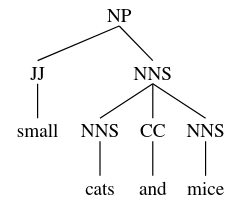
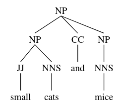
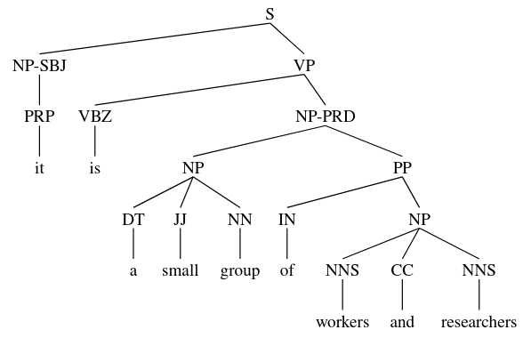

class: center, middle

### Introduction to Human Language Technologies

# Lab.8: Parsing

Gerard Escudero & Jordi Turmo

Natural Language Research Group

<br>

## Master on Artificial Intelligence

<br>


---
class: left, middle, inverse

# Outline

* .cyan[Constituency parsing]

  - No probabilistic

  - Exercise

  - Probabilistic

* Dependency parsing

---

# Constituency parsing with NLTK

#### Non-probabilistic parsers:

* ChartParser (default parser is BottomUpLeftCornerChartParser)

* BottomUpChartParser, LeftCornerChartParser

* TopDownChartParser, EarleyChartParser

* ...

#### Probabilistic parsers:

* InsideChartParser, RandomChartParser, LongestChartParser (they are bottom-up parsers)

* ViterbiParser

* CoreNLPParser (third-party’s parser)

* ...

---
class: left, middle, inverse

# Outline

* .cyan[Constituency parsing]

  - .cyan[No probabilistic]

  - Exercise

  - Probabilistic

* Dependency parsing

---

# Charts I

### Requirements

```python3
import nltk
from nltk import CFG, ChartParser
!pip install svgling
import svgling
```

### Use

```python3
grammar = CFG.fromstring('''
  NP  -> NNS | JJ NNS | NP CC NP
  NNS -> "cats" | "dogs" | "mice" | NNS CC NNS 
  JJ  -> "big" | "small"
  CC  -> "and" | "or"
  ''')

parser = ChartParser(grammar, trace=1)

parse = parser.chart_parse(['small', 'cats', 'and', 'mice'])
👉
```

---

# Charts II

```
|.  small  .   cats  .   and   .   mice  .|
|[---------]         .         .         .| [0:1] 'small'
|.         [---------]         .         .| [1:2] 'cats'
|.         .         [---------]         .| [2:3] 'and'
|.         .         .         [---------]| [3:4] 'mice'
|[---------]         .         .         .| [0:1] JJ -> 'small' *
|[--------->         .         .         .| [0:1] NP -> JJ * NNS
|.         [---------]         .         .| [1:2] NNS -> 'cats' *
|.         [---------]         .         .| [1:2] NP -> NNS *
|.         [--------->         .         .| [1:2] NNS -> NNS * CC NNS
|[-------------------]         .         .| [0:2] NP -> JJ NNS *
|[------------------->         .         .| [0:2] NP -> NP * CC NP
|.         [--------->         .         .| [1:2] NP -> NP * CC NP
|.         .         [---------]         .| [2:3] CC -> 'and' *
|.         [------------------->         .| [1:3] NNS -> NNS CC * NNS
|[----------------------------->         .| [0:3] NP -> NP CC * NP
|.         [------------------->         .| [1:3] NP -> NP CC * NP
|.         .         .         [---------]| [3:4] NNS -> 'mice' *
|.         .         .         [---------]| [3:4] NP -> NNS *
|.         .         .         [--------->| [3:4] NNS -> NNS * CC NNS
|.         [-----------------------------]| [1:4] NNS -> NNS CC NNS *
|.         [-----------------------------]| [1:4] NP -> NNS *
|.         [----------------------------->| [1:4] NNS -> NNS * CC NNS
|[=======================================]| [0:4] NP -> JJ NNS *
|[--------------------------------------->| [0:4] NP -> NP * CC NP
|.         [----------------------------->| [1:4] NP -> NP * CC NP
|.         .         .         [--------->| [3:4] NP -> NP * CC NP
|[=======================================]| [0:4] NP -> NP CC NP *
|.         [-----------------------------]| [1:4] NP -> NP CC NP *
|.         [----------------------------->| [1:4] NP -> NP * CC NP
|[--------------------------------------->| [0:4] NP -> NP * CC NP
```

---

# Charts III

### Results I

```python3
parse.num_edges()
👉  28

parse.edges()
👉
[[Edge: [0:1] 'small'],
 [Edge: [1:2] 'cats'],
 [Edge: [2:3] 'and'],
 [Edge: [3:4] 'mice'],
 [Edge: [0:1] JJ -> 'small' *],
 [Edge: [0:1] NP -> JJ * NNS],
 [Edge: [1:2] NNS -> 'cats' *],
 [Edge: [1:2] NP -> NNS *],
 [Edge: [1:2] NNS -> NNS * CC NNS],
 [Edge: [0:2] NP -> JJ NNS *],
 [Edge: [0:2] NP -> NP * CC NP],
 [Edge: [1:2] NP -> NP * CC NP],
 [Edge: [2:3] CC -> 'and' *],
 [Edge: [1:3] NNS -> NNS CC * NNS],
 [Edge: [0:3] NP -> NP CC * NP],
 [Edge: [1:3] NP -> NP CC * NP],
 [Edge: [3:4] NNS -> 'mice' *],
 [Edge: [3:4] NP -> NNS *],
 [Edge: [3:4] NNS -> NNS * CC NNS],
 [Edge: [1:4] NNS -> NNS CC NNS *],
 [Edge: [1:4] NP -> NNS *],
 [Edge: [1:4] NNS -> NNS * CC NNS],
 [Edge: [0:4] NP -> JJ NNS *],
 [Edge: [0:4] NP -> NP * CC NP],
 [Edge: [1:4] NP -> NP * CC NP],
 [Edge: [3:4] NP -> NP * CC NP],
 [Edge: [0:4] NP -> NP CC NP *],
 [Edge: [1:4] NP -> NP CC NP *]]
```

---

# Charts IV

### Results I

```python3
ts = list(parse)

'{num} trees.'.format(num=len(ts))
👉  2 trees.

print(ts[0])
👉  (NP (JJ small) (NNS (NNS cats) (CC and) (NNS mice)))
```

.cols5050[
.col1[
```python3
ts[0]
👉
```

]
.col2[
```python3
ts[1]
👉
```

]]

---

# Charts V

### Diferent Strategies

- BottomUpChartParser

- BottomUpLeftCornerChartParser

- EarleyChartParser

- ...

### Use Example

```python3
from nltk import TopDownChartParser
parser = nltk.TopDownChartParser(grammar)
parse = parser.parse(sent)
```

---
class: left, middle, inverse

# Outline

* .cyan[Constituency parsing]

  - .brown[No probabilistic]

  - .cyan[Exercise]

  - Probabilistic

* Dependency parsing

---

# Exercise

* Consider the following sentence: <br>
`Lazy cats play with mice.`

* Expand the grammar of the example related to non-probabilistic chart parsers in order to subsume this new sentence.

* Perform the constituency parsing using a BottomUpChartParser, a BottomUpLeftCornerChartParser and a LeftCornerChartParser.

* For each one of them, provide the resulting tree, the number of edges and the list of explored edges.

* Which parser is the most efficient for parsing the sentence?

* Which edges are filtered out by each parser and why?

---
class: left, middle, inverse

# Outline

* .cyan[Constituency parsing]

  - .brown[No probabilistic]

  - .brown[Exercise]

  - .cyan[Probabilistic]

* Dependency parsing

---

# Probabilistic Charts I

### Requirements

```python3
import nltk
from nltk.parse.pchart import PCFG, InsideChartParser
!pip install svgling
import svgling
```

### Use

```python3
grammar = PCFG.fromstring('''
  NP  -> NNS [0.5] | JJ NNS [0.3] | NP CC NP [0.2]
  NNS -> "cats" [0.1] | "dogs" [0.2] | "mice" [0.3] | NNS CC NNS [0.4]
  JJ  -> "big" [0.4] | "small" [0.6]
  CC  -> "and" [0.9] | "or" [0.1]
  ''')

parser = InsideChartParser(grammar)
parse = parser.parse(['small', 'cats', 'and', 'mice'])
```

---

# Probabilistic Charts II

### Results

```python3
ts = list(parse)

'{num} trees.'.format(num=len(ts))
👉  2 trees.

[print(t) for t in ts]
👉
(NP (JJ small) (NNS (NNS cats) (CC and) (NNS mice))) (p=0.001944)
(NP (NP (JJ small) (NNS cats)) (CC and) (NP (NNS mice))) (p=0.000486)
```

### Notes

- Strategies *bottom-up*

- InsideChartParser, RandomChartParser, LongestChartParser

---

# ViterbiParser I

### Requirements

```python3
import nltk
from nltk import  PCFG, ViterbiParser
!pip install svgling
import svgling
```

### Use

```python3
grammar = PCFG.fromstring('''
  NP  -> NNS [0.5] | JJ NNS [0.3] | NP CC NP [0.2]
  NNS -> "cats" [0.1] | "dogs" [0.2] | "mice" [0.3] | NNS CC NNS [0.4]
  JJ  -> "big" [0.4] | "small" [0.6]
  CC  -> "and" [0.9] | "or" [0.1]
  ''')

parser = ViterbiParser(grammar)
parse = parser.parse(['small', 'cats', 'and', 'mice'])
```

---

# ViterbiParser II

### Results

```python3
ts = list(parse)

'{num} trees.'.format(num=len(ts))
👉  1 trees.

[print(t) for t in ts]
👉
(NP (JJ small) (NNS (NNS cats) (CC and) (NNS mice))) (p=0.001944)
```

---

# Learning PCFGs I

### Requirements

```python3
import nltk
nltk.download('treebank')
from nltk.corpus import treebank
from nltk import PCFG, ViterbiParser
!pip install svgling
import svgling
```

### DataSet

```python3
productions = []
S = nltk.Nonterminal('S')
for f in treebank.fileids():
    for tree in treebank.parsed_sents(f):
        productions += tree.productions()
```

---

# Learning PCFGs II

### Learning

```python3
grammar = nltk.induce_pcfg(S, productions)

len(grammar.productions())  👉  21763

grammar.productions()[10:15]
👉
[JJ -> 'old' [0.00411382],
 VP -> MD VP [0.0523088],
 MD -> 'will' [0.30205],
 VP -> VB NP PP-CLR NP-TMP [0.000137836],
 VB -> 'join' [0.00156617]]
```

---

# Application of the PCFG I

### Use

```python3
sent = ['it', 'is', 'a', 'small', 'group', 'of', 'workers', 'and', 'researchers']
parser = ViterbiParser(grammar)
parse = parser.parse(sent)

tree = next(parse)
print(tree)
👉
(S
  (NP-SBJ (PRP it))
  (VP
    (VBZ is)
    (NP-PRD
      (NP (DT a) (JJ small) (NN group))
      (PP
        (IN of)
        (NP (NNS workers) (CC and) (NNS researchers)))))) (p=2.64379e-21)
```

---

# Application of the PCFG II

### Graphic

```python3
tree
👉
```



---
class: left, middle, inverse

# Outline

* .brown[Constituency parsing]

  - .brown[No probabilistic]

  - .brown[Exercise]

  - .brown[Probabilistic]

* .cyan[Dependency parsing]

---

# Dependencies in spaCy I

### Requirements

```python3
import spacy
nlp = spacy.load('en_core_web_sm')
```

### Use

```python3
doc = nlp('The boy plays with a black dog.')

[(token.text, token.tag_, token.dep_, token.head) for token in doc]
👉
[('The', 'DT', 'det', boy),
 ('boy', 'NN', 'nsubj', plays),
 ('plays', 'VBZ', 'ROOT', plays),
 ('with', 'IN', 'prep', plays),
 ('a', 'DT', 'det', dog),
 ('black', 'JJ', 'amod', dog),
 ('dog', 'NN', 'pobj', with),
 ('.', '.', 'punct', plays)]
```

---

# Dependencies in spaCy II

### Graphic

```python3
spacy.displacy.render(doc,style='dep',jupyter=True)
👉
```


---

# Dependencies in TextServer I

### Requirements

- Script auxiliar: [textserver.py](../codes/textserver.py)

```
from google.colab import drive
import sys

drive.mount('/content/drive')
sys.path.insert(0, '/content/drive/My Drive/Colab Notebooks/ihlt')
from textserver import TextServer
```

---

# Dependencies in TextServer II

### Use

```python3
ts = TextServer('user', 'passwd', 'dependencies')

ts.dependencies('The boy plays with a black dog.')
👉
[{'function': 'ROOT',
  'word': 'plays',
  'children': [{'function': 'SBJ',
    'word': 'boy',
    'children': [{'function': 'NMOD', 'word': 'The'}]},
   {'function': 'ADV',
    'word': 'with',
    'children': [{'function': 'PMOD',
      'word': 'dog',
      'children': [{'function': 'NMOD', 'word': 'a'},
       {'function': 'NMOD', 'word': 'black'}]}]},
   {'function': 'P', 'word': '.'}]}]
```

---

# Dependencies in FreeLing


.footnote[[https://nlp.lsi.upc.edu/freeling/demo/demo.php](https://nlp.lsi.upc.edu/freeling/demo/demo.php)]


